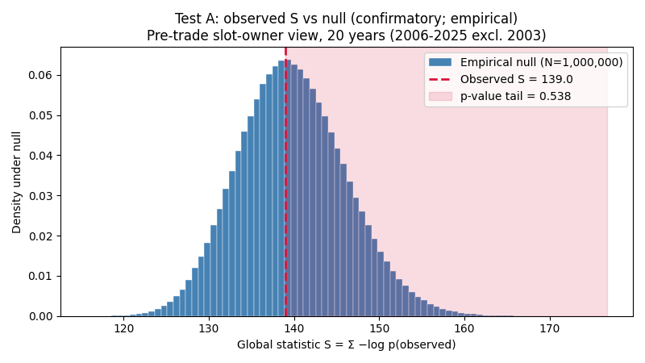
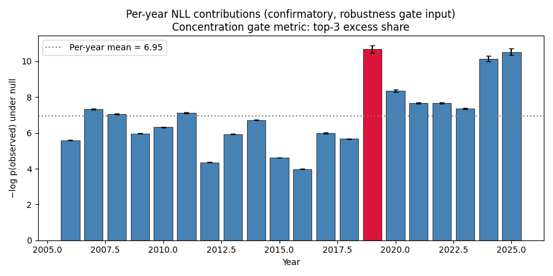
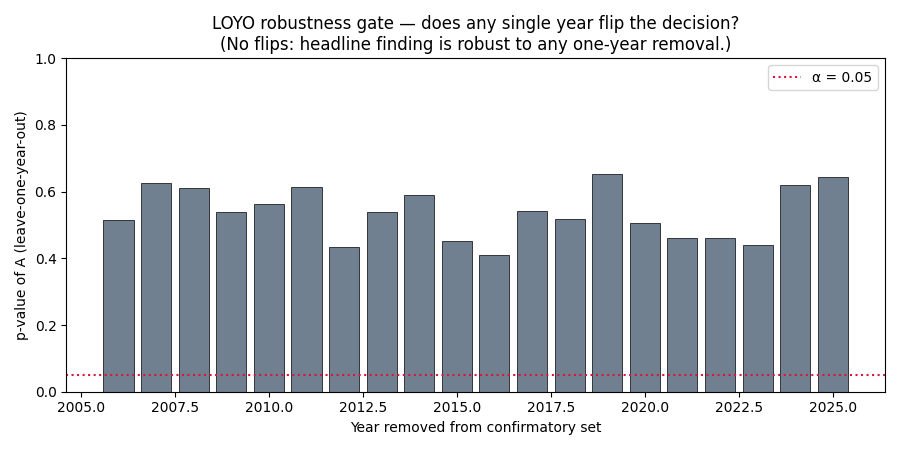
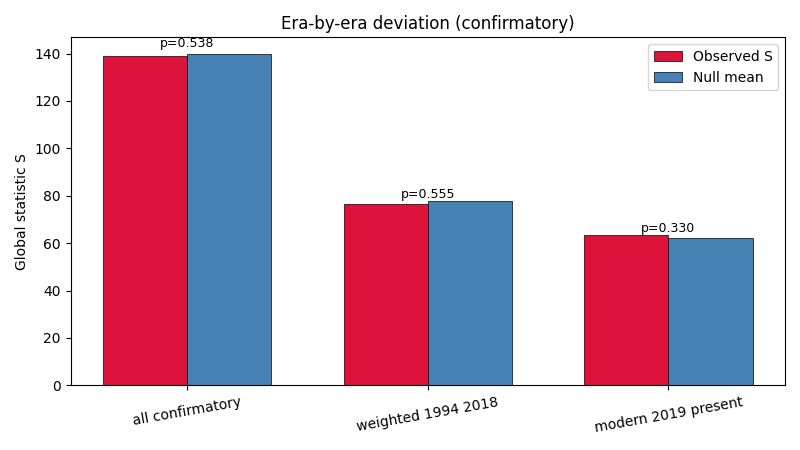
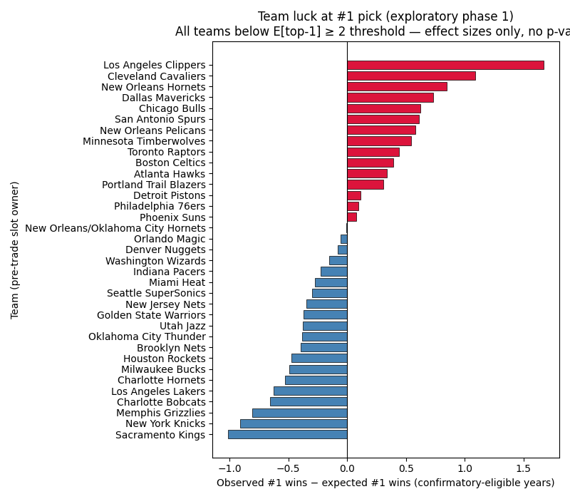
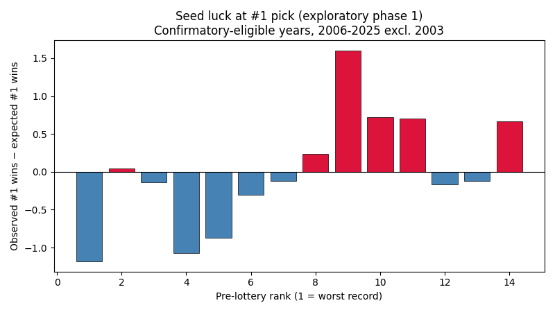
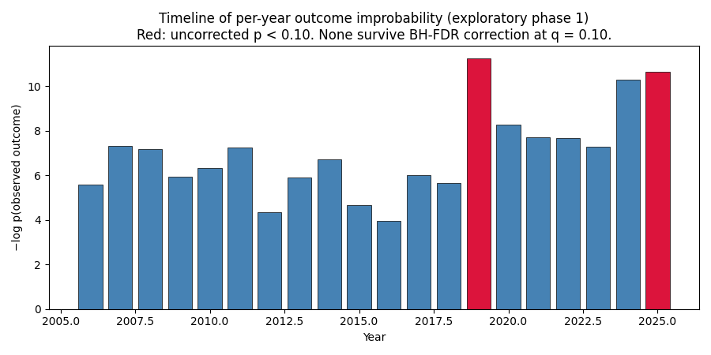

# NBA Draft Lottery Fairness — Results Summary

## Executive summary

**Primary research question:** *Is there statistical evidence that NBA draft lottery outcomes are inconsistent with the officially stated lottery probabilities?*

**Headline finding: No.** Across all four pre-registered confirmatory tests, none reaches α = 0.05 after Holm-Bonferroni correction. Observed outcomes are fully consistent with the stated probability model over the confirmatory-eligible sample.

Pre-registered confirmatory tests with Holm-Bonferroni correction over the family of 4.

| Test | Statistic | Null mean | p-value | Holm-adj p | Rejected? |
|------|-----------|-----------|---------|------------|-----------|
| A | 138.9898 | 139.8286 | 0.538281 | 1.000000 | No |
| A_pre2019 | 76.6458 | 77.6233 | 0.554927 | 1.000000 | No |
| A_post2019 | 63.5225 | 62.2089 | 0.330216 | 1.000000 | No |
| T1 | 4 | 4.2300 | 1.000000 | 1.000000 | No |

All four observed statistics sit near the center of their null distributions, not in the tails. Source: [`scripts/run_stat_tests.py`](../scripts/run_stat_tests.py).

Metadata: N = 1,000,000 Monte Carlo simulations; seed = 0; git SHA = `1264d21888`.

### Robustness gates (for test A)

- **Concentration gate** (top-3 year NLL excess share < 0.5 required): value = 0.7434, **FAILS**. A global-anomaly headline would be reclassified to outlier-year evidence if the concentration gate had failed with a significant A. Since A itself is not significant, this is moot.
- **LOYO gate** (no single-year removal should flip the α=0.05 decision): 0 / 20 years flip the decision. LOYO p-values range from 0.411 to 0.652. Headline finding is robust to any single-year removal.

---

## Confirmatory family (frozen before execution)

See [`docs/statistical_analysis_plan.md`](statistical_analysis_plan.md) and [`docs/analysis_plan_hashes.txt`](analysis_plan_hashes.txt) for the pre-registered plan.

### Test A: Global negative log-likelihood

- Confirmatory-eligible years: **20** (2006-2025 excluding 2003).
- Observed S = Σ −log p(observed drawn tuple) = **138.9898** (MC SE = 0.3513).
- Null distribution: mean = 139.8286, std = 6.2865.
- **p-value = 0.538281** (MC SE = 0.000499).

**Figure 1.** Test A's observed global NLL statistic S = 139.0 plotted against the empirical Monte Carlo null distribution (N = 1,000,000 samples), over the 20 confirmatory-eligible years. The observed S sits near the center of the null, not in the tail (p = 0.538), so there is no evidence of aggregate non-randomness in the drawn-pick outcomes. Source: [`figure_global_vs_null`](../nba_lottery/viz.py) in `viz.py`.

**Figure 2.** Each year's contribution to test A's global statistic, with Monte Carlo standard error bars and the per-year mean as a reference line. The 2019 Pelicans outcome is the tallest single bar (consistent with the most-improbable-year finding), but no single year dominates enough to drive the global test. Source: [`figure_per_year_contributions`](../nba_lottery/viz.py) in `viz.py`.

**Figure 3.** Recomputed p-value of test A with each year removed from the confirmatory set. All LOYO p-values are well above α = 0.05, showing that the headline null result is robust to any single-year removal — there is no "hidden" anomaly that disappears when one year is dropped. Source: [`figure_loyo`](../nba_lottery/viz.py) in `viz.py`.

### Era-stratified tests

Observed global statistic S vs. null-mean S for each era sub-regime and the combined confirmatory set.

| Era | n_years | S_obs | null mean | p-value |
|-----|---------|-------|-----------|---------|
| all confirmatory | 20 | 138.9898 | 139.8286 | 0.538281 |
| weighted 1994 2018 | 13 | 76.6458 | 77.6233 | 0.554927 |
| modern 2019 present | 7 | 63.5225 | 62.2089 | 0.330216 |

All three sub-tests have observed values within 1 standard deviation of the null mean, so neither era shows deviation from its official process. Source: [`scripts/run_stat_tests.py`](../scripts/run_stat_tests.py).

**Figure 7.** Observed S vs. null-mean S for each era sub-regime (2006-2018 weighted, 2019-present modern, and the combined confirmatory set). All three sub-tests have observed values within 1 standard deviation of the null mean, so neither era shows deviation from its official process. Source: [`figure_era_comparison`](../nba_lottery/viz.py) in `viz.py`.

### Test T1: Top-seed wins #1 pick (Poisson-binomial exact)

- Over 20 confirmatory-eligible years: the rank-1 team (most combinations) won the #1 pick in **4** years, vs. expected count **4.2300** under the Poisson-binomial null.
- **p-value (two-sided) = 1.000000**.
- T1 uses the exact Poisson-binomial distribution over per-year #1-winning probabilities; no Monte Carlo needed.

Observed count almost exactly equals the expected count, so there is no gap to explain. Source: [`top1_poisson_binomial_test`](../nba_lottery/stats.py) in `stats.py`.

### Holm-Bonferroni summary

Over the 4 confirmatory tests, smallest adjusted p-value = **1.000**. No rejection at α = 0.05.

---

## Exploratory phase 1 (BH-FDR at q = 0.10, separate family)

Summary of exploratory families; none survives BH-FDR correction at q = 0.10.

- **team_luck:** 0 tests, 0 rejections after BH-FDR, min adjusted p = 1.0.
- **seed_luck:** 4 tests, 0 rejections after BH-FDR, min adjusted p = 1.0.
- **outlier_years:** 20 tests, 0 rejections after BH-FDR, min adjusted p = 0.673706.

Zero exploratory rejections across all three families after multiplicity control — consistent with the confirmatory null result. Source: [`scripts/run_stat_tests.py`](../scripts/run_stat_tests.py).

### Team luck at #1 pick

All 35 lottery-participating teams fall below the pre-specified frequentist eligibility threshold (expected top-1 count ≥ 2). Per the plan, their results are reported as effect sizes with no p-values.

**Figure 4.** Each team's observed minus expected #1-pick wins over the 20 confirmatory-eligible years (pre-trade slot-owner view). Every team falls below the frequentist eligibility threshold (expected top-1 ≥ 2), so results are reported as effect sizes only with no p-values; the largest deviations (Clippers +1.67, Cavaliers +1.09, Kings −1.01, Knicks −0.91) are too small a signal to distinguish from chance in this sample. Source: [`figure_team_luck`](../nba_lottery/viz.py) in `viz.py`.

Largest effects by magnitude (descriptive only; no p-values).

| Team | N years | Observed #1 wins | Expected | Excess |
|------|---------|------------------|----------|--------|
| Los Angeles Clippers | 7 | 2 | 0.3290 | +1.6710 |
| Cleveland Cavaliers | 8 | 2 | 0.9100 | +1.0900 |
| Sacramento Kings | 18 | 0 | 1.0110 | -1.0110 |
| New York Knicks | 13 | 0 | 0.9130 | -0.9130 |
| New Orleans Hornets | 3 | 1 | 0.1510 | +0.8490 |
| Memphis Grizzlies | 8 | 0 | 0.8080 | -0.8080 |
| Dallas Mavericks | 6 | 1 | 0.2690 | +0.7310 |
| Charlotte Bobcats | 7 | 0 | 0.6580 | -0.6580 |
| Los Angeles Lakers | 7 | 0 | 0.6280 | -0.6280 |
| Chicago Bulls | 9 | 1 | 0.3750 | +0.6250 |

These are descriptive effect sizes, not evidence of manipulation. With only 20 years and each team appearing in at most 18, the sample is too small to distinguish any of these from chance.

### Seed luck at #1 pick

**Figure 5.** Observed minus expected #1-pick wins by pre-lottery rank (rank 1 = worst record) across the confirmatory-eligible years. The distribution is roughly centered on zero with no consistent pattern of top-seeds or bottom-seeds over- or under-performing, consistent with the null. Source: [`figure_seed_luck`](../nba_lottery/viz.py) in `viz.py`.

### Outlier-year detection

**Figure 6.** Per-year −log p of the observed drawn tuple, computed against each year's specific null distribution; bars in red have uncorrected p < 0.10. After BH-FDR correction at q = 0.10, no year remains significant — the most-surprising year (2019) goes from uncorrected p ≈ 0.05 to adjusted p ≈ 0.67. Source: [`figure_outlier_years`](../nba_lottery/viz.py) in `viz.py`.

Most-improbable years by uncorrected p; all fail BH-FDR correction.

| Year | observed_nll | two-sided p | BH-adjusted p |
|------|--------------|-------------|---------------|
| 2019 | 11.2506 | 0.049306 | 0.673706 |
| 2025 | 10.6375 | 0.099608 | 0.673706 |
| 2024 | 10.2892 | 0.141126 | 0.673706 |
| 2007 | 7.3294 | 0.179914 | 0.673706 |
| 2011 | 7.2446 | 0.193477 | 0.673706 |

---

## Exploratory phase 2 (deferred — see [`docs/limitations.md`](limitations.md))

- **narrative_market_covariates:** deferred — msa_population, forbes_valuation, attendance_rank not collected; covariate coverage rule (>20% missing drops covariate) would drop all three
- **pick_recipient_robustness:** deferred — pick-recipient view requires unconditional-ownership filter; not yet wired
- **top3_top4_jump_analysis:** deferred — descriptive only per plan; not run in this pass

---

## Interpretation

### What the data say

- **No confirmatory evidence of non-randomness** in the 20 confirmatory-eligible years (2006-2025 excluding 2003) using the primary estimand (pre-trade lottery slot owner).
- **Leave-one-year-out robustness:** no single year's removal flips the decision; the headline is not a single-year outlier effect.
- **T1 top-seed analysis over all 41 years:** observed 4 top-seed wins vs 4.23 expected — perfectly centered on the null expectation.

### What the data cannot say

- **Statistical power is limited.** With only 20-41 years of data (and at most ~4 drawn picks per year), this analysis can detect roughly a doubling of a team's expected #1 rate (from ~5.6 to ~11 over 41 years). It cannot detect subtler biases, persistent 10-20% perturbations, or rare single-year manipulations. See [`docs/power_validation.md`](power_validation.md) for specific detectability thresholds.
- **Failing to reject the null does not prove fairness.** It means the observed outcomes are consistent with the stated model at this sample size. A subtler non-randomness pattern would not have been detected.
- **Rejecting the null would not prove manipulation.** The only year that approaches uncorrected significance (2019, p = 0.049) is a year where the rank-7 Pelicans won with 6% odds — a rare but possible outcome under the stated process. After BH-FDR correction it is not significant.

### Scope limitations surfaced by this analysis

- **Pre-2006 years** (1985-2005 minus 2003) could not be included in test A because Wikipedia's draft pages for those years do not contain lottery participant/odds tables. This is a data-source limitation, not a modeling choice. Primary-source NBA.com archives for this range exist but are heavy-JS and rot quickly.
- **2003** was excluded because Wikipedia's published probabilities for that year disagree with exact Monte Carlo marginals by up to 46σ across multiple teams — a likely source transcription error.
- **Phase-2 covariates** (market size, franchise valuation, attendance) were deferred because their collection was not part of this pipeline.

### Conclusion

Over the 2006-2025 confirmatory-eligible sample, the observed NBA draft lottery outcomes show **no statistical evidence of inconsistency with the officially stated probability model** under any of the four pre-registered confirmatory tests. The result is robust to leave-one-year-out analysis and to era stratification. Exploratory analyses identify no team, seed, or year as anomalous after multiple-testing correction.

This does not prove the lottery is fair — it means that if any bias exists, it is below this study's detection threshold. See [`docs/limitations.md`](limitations.md) for a full accounting of what this study can and cannot establish.
